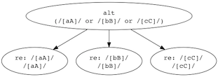
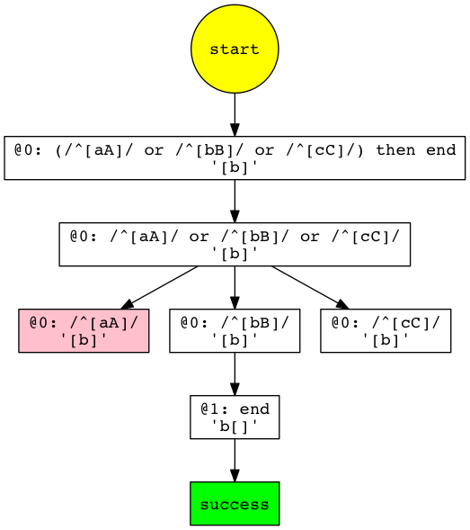

packrattle
==========

[](https://travis-ci.org/robey/packrattle)

This is a simple GLL-based parser-combinator library for coffeescript / javascript. It lets you write parsing code without the use of an external tool like lex or antlr: the parser is in js/cs with the rest of your code!

An example, from the unit tests:

```javascript
var pr = require("packrattle");

var csv = pr.repeatSeparated(
  pr.regex(/([^,]*)/).onMatch(function (m) { return m[0]; }),
  /,/
);

csv.run("this,is,csv");
=> [ "this", "is", "csv" ]
```

Parser-combinators start from a simple idea: a "parser" is a function that takes a string and position, processes some chunk of the string, and returns a new position, along with the digested part of the string. In other words, a parser does:

    (position) -> (new_position, result)

on success, or

    (position) -> (position, error_message)

on failure.

You can start with a few basic parsers which match a string or regex, and build more complex parsers out of functions that combine them: "a or b", "a then b", "repeat(a)", and so on.

Being "GLL-based" means that a trampoline is used to avoid recursion and to memoize (cache) intermediate results. This lets you parse almost any grammar, even if it's left recursive or ambiguous. For example, the grammar

    expr ::= (expr "+" expr) | /\d+/

would need to be refactored a lot to work in most parser libraries. It can be expressed in packrattle as

```javascript
var expr = pr.alt(
  pr.seq(function() { return expr; }, "+", function() { return expr; }),
  pr.regex(/\d+/).onMatch(function (m) { return m[0]; })
);
```

and it actually matches strings:

```javascript
expr.run("3+10+200");
=> [ [ '3', '+', '10' ], '+', '200' ]
```

The nested anonymous functions on line 2 allow javascript to handle recursive definitions by delaying evaluation. The functions will only be called once (when first invoked) and then cached.


Further reading
---------------

- There's a wiki page on parser-combinators here: http://en.wikipedia.org/wiki/Parser_combinator

- Vegard Øye has an excellent (highly-recommended) tutorial on how GLL parsers work, with an implementation in a lisp-like language: https://github.com/epsil/gll

- Daniel Spiewak wrote a paper on GLL and his work upgrading scala's parser-combinator library to use it: http://www.cs.uwm.edu/~dspiewak/papers/generalized-parser-combinators.pdf


Basic parsers
-------------

The basic parsers attempt to match a chunk of text. These are all global functions in the packrattle module.

- `string("...")` - match exactly this string, and return it

- `regex(/.../)` - match this regex, and return the regex "match" object (which can be used to extract any groups)

- `end()` - matches only the end of the string

- `reject()` - always fails to match


Transforms
----------

Parser objects have a few methods on them that will allow you to transform the match results. This is how you turn the parser output into an AST, or cause the parser to evaluate expressions as it parses.

For example, this parser matches strings of digits and transforms them into a number:

```javascript
var number = pr.regex(/\d+/).onMatch(function (x) { return parseInt(x); });
```

- `onMatch(f)` - If the parser is successful, call 'f' on the match result, using the return value of 'f' as the new match result.

- `onFail(newMessage)` - Replace the error message for this parser when it fails to match.

- `describe(message)` - Calls `onFail("Expected " + message)`, but also sets the parser's description for debugging purposes.

- `matchIf(f)` - If the parser is successful, call 'f' on the match result: if it returns true, continue as normal, but if it returns false, fail to match.


Onmatch
-------

The `onMatch(f)` transform calls `f` as a function with two parameters:

```javascript
f(match, state)
```

The `match` parameter is the result of the matching parser. For simple parsers like `string` and `regex`, this will be the string literal or regex match object, respectively. For nested parsers with their own `onMatch` transforms, the parameter will be the object the nested parsers returned. For example, the `seq` combinator (below) returns an array of the sequence of matches. An expression parser might build up a tree of expression nodes.

The `state` parameter is a `ParserState` object, described below, under "Executing". The `pos()/endpos()` pair of the state will mark the span of the string that this parser matched. This can be useful for tracking the original source of parsed text when building a large object.


Combinators
-----------

The real power is in combining the parsers. These are all global functions in the packrattle module.

- `seq(p1, p2, ...)` - Match all of the parsers in sequence. The match result will be an array of all of the non-null match results.

- `alt(p1, p2, ...)` - If 'p1' matches, return that as the result; otherwise, try 'p2', and so on, until finding a match. If none of the parsers match, fail.

- `optional(p, defaultValue = "")` - Match 'p' or return the default value (usually the empty string), succeeding either way.

- `repeat(p, minCount = 0, maxCount = infinity)` - Match 'p' multiple times (often written as "`p*`"). The match result will be an array of all the non-null 'p' results. (Note that it's trivial to match zero times, so often you want to set 'minCount' to 1.)

- `check(p)` - Verify that 'p' matches, but don't advance the parser's position. Perl calls this a "zero-width lookahead".

- `commit(p)` - If 'p' matches, packrattle will no longer backtrack through previous 'alt' alternatives: the parsing is "committed" to this branch. (This can be used with 'onFail' to give less ambiguous error messages.)

- `not_(p)` - Turn a successful match of 'p' into a failure, or a failure into a success (with an empty string as the match result).

- `drop(p)` - If 'p' matches, return null as the match result, which will cause it to be omitted from the result of any sequence.

All of the combinators are also defined as methods on the parsers, so you can chain them with method calls. The method versions all take one fewer argument, because the first 'p' is implied.

For example, these two lines are equivalent:

```javascript
var comment = pr.seq(pr.commit(pr.string("#")), pr.regex(/[^\n]+\n/));
var comment = pr.seq(pr.string("#").commit(), pr.regex(/[^\n]+\n/));
```


Convenience methods
-------------------

These are trivially implemented using the transforms and combinators above, but are commonly used, so they just come with the library, as global functions.

- `seqIgnore(ignore, p1, p2, ...)` - Like seq, but make an attempt to match 'ignore' before each parser, throwing away the result if it matches and ignoring if it doesn't. This is typically used to discard whitespace.

- `repeatIgnore(ignore, p, minCount = 0, maxCount = infinity)` - Similar to 'seqIgnore', attempts to match 'ignore' before each iteration of 'p', throwing away the result.

- `repeatSeparated(p, separator = "", minCount = 1, maxCount = infinity)` - Like 'repeatIgnore', but there must be at least one match of 'p', the separator is not optional, and the separator is only matched (and discarded) between items.


Reduce
------

The reduce method is borrowed from scala's parser-combinator library, and is particularly useful for parsing expression trees.

- `reduce(p, separator = "", accumulator = null, reducer = null, minCount = 1, maxCount = infinity)`

Like 'repeatSeparated', it attempts to match at least one 'p', separated by 'separator'. In standard syntax, it matches:

    p (separator p)*

with an optional limit on the minimum or maximum number of 'p' there can be. Two functions are called to transform the match results:

- `accumulator(first)` is called with the first result of 'p' and can be used to transform the result, just like 'onMatch'. The default accumulator creates a new array with the match result as its only element.

- `reducer(total, sep, next)` is called for each subsequent match of 'p' and a separator. The first parameter is the total result so far (or the result of the accumulator function). The second is the result of the separator, and the last is the result of the current 'p'. This function should return the new 'total' that will be passed in on future matches.

For example, here is a parser that identifies strings like "3+50+2" and returns the match result 55:

```javascript
var number = pr.regex(/\d+/).onMatch(function (m) { return parseInt(m[0]); });

var expr = pr.reduce(
  number,
  "+",
  function (n) { return n; },
  function (total, sep, n) { return total + n; }
);

expr.run("3+50+2");
=> 55
```


Implicit conversion
-------------------

Any function that takes a parser will also implicitly convert non-parser objects into parsers, to simplify your code:

- A string will be converted to `string(...)`.

- A regex will be converted to `regex(...)`.

- An array will be converted to `seq(...)`.

- A function will be called (with no arguments), under the assumption that it returns a parser. each function is called exactly once, and the result is cached. this can be used to make forward references, if your parser is recursive.

The packrattle module object can be used as a function for converting objects into parsers, so:

```javascript
pr.seq(pr.regex(/\d+/), pr.string("!").drop())
```

can also be expressed as:

```javascript
pr([ /\d+/, pr("!").drop() ])
```


Executing
---------

The simplest way to execute a parser is to call the `run` method on it, with a string to parse:

```javascript
expr.run("3+20*5")
```

This attempts to match the entire string by calling `consume` (see below). If it succeeds, the 'match' object is returned. If it fails, an Error is thrown with a `state` field containing the parser state of the error, described below.

There are also two manual ways to execute a parser:

- `pr.parse(parser, string, options = {})` - matches as much of the string as it can
- `pr.consume(parser, string, options = {})` - matches the entire string, or fails

Because packrattle will stop once it succeeds in matching, you usually want 'consume'. In some ambiguous parsers, 'parse' may seem to stop before consuming much of the string, because it operates "lazily" instead of "greedily".

(`consume(p, s)` is just an alias for `parse(seq(p, end), s)`.)

Both 'parse' and 'consume' return a match object with these fields:

- `ok` - true if the parser succeeded, false if not
- `state` - a `ParserState` object with the current position (see below)
- `match` - the match result (if `ok` is true)
- `message` - a string error message (if `ok` is false)

The `ParserState` object contains a few helper methods:

- `pos()` - the index within the string of the successful match or last error
- `endpos()` - the index within the string of the successful match (for errors, same as `pos()`)
- `lineno()` - the current line number of `pos()`, assuming `\n` divides lines, counting from 0
- `line()` - the text of the line around `pos()`, assuming `\n` divides lines
- `toSquiggles()` - an array containing `line()` and a a string with little squiggle characters highlighting the span of `pos()` to `endpos()`


Debugging
---------

Ocassionally, the first draft of a parser may not work exactly the way you want it to. To help you debug, packrattle provides two methods for generating 'dot' graph data.

The first is `toDot()`, which will generate a directed graph of the nesting of parsers. This is useful if you want to see how the sausage is made inside packrattle, as it assembles your parser objects into smaller bits. For example:

```javascript
var pr = require("packrattle");
var fs = require("fs");

var abc = pr.alt(/[aA]/, /[bB]/, /[cC]/);
fs.writeFileSync("abc1.dot", abc.toDot());
```

will write a graph file named "abc.dot". Dot utilities will be able to generate an image like the one below.

```sh
$ dot -Tpng -oabc.png ./abc.dot
```



The second method is to pass `debugGraph` as an option to the `parse` or `consume` methods. This tells packrattle to trace its progress through a string, and store the results in the `ParserState` object. On success or failure, we can then generate a 'dot' file of the trace.

```javascript
var pr = require("./lib/packrattle");
var fs = require("fs");

var abc = pr.alt(/[aA]/, /[bB]/, /[cC]/);
var rv = pr.consume(abc, "b", { debugGraph: true });
fs.writeFileSync("abc2.dot", rv.state.debugGraphToDot());
```

This (trivial) trace shows the failed match of "a" before succeeding at "b".




Author
------

Credit and blame: Robey Pointer <robeypointer@gmail.com>

Special thanks to Daniel Spiewak, Brian McKenna, and Vegard Øye for sharing info about GLL.
